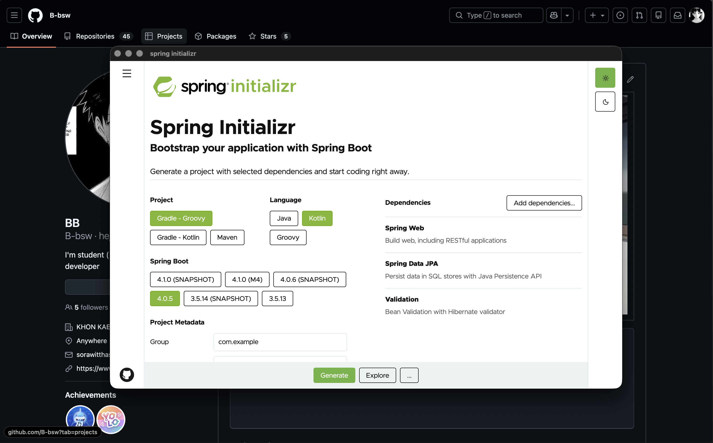

# Getting Started

> clone repo to your device

```bash
git clone https://github.com/B-bsw/spring-initlizr-program.git

cd spring-initlizr-program
```

> install dependencies and run

```bash
bun install
# or
# npm install

bun dev
# or
# npm run dev
```

> build program

```bash
bun run build
# or
# npm run build
```

# Preview

<div align='center'>
    
</div>
